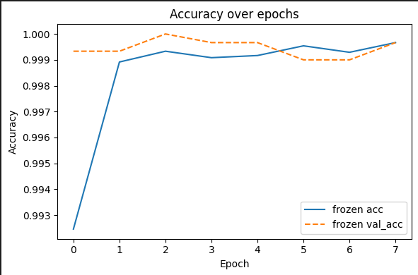
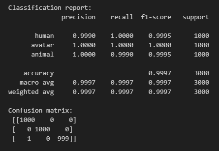

### Photo Classification with ResNet50

**Author** 
Allen Long

#### Executive summary
This project performs **exploratory data analysis (EDA)** and builds a **baseline image-classification model** to determine whether a Microsoft 365 profile picture contains a **real human face** vs. **avatar** vs. **animal** imagery.  
In this module, the focus is on:
- Cleaning and organizing the dataset(s)
- Feature engineering where appropriate
- EDA visualizations to understand variables and relationships
- A single baseline model to serve as a comparison point for Module 24

While this project does not attempt to create the application that will read profile pictures, it does
provide the foundation model that could be used for that effort.

#### Rationale
Accurate identification of real human faces in corporate profile photos improves directory quality, compliance with internal policies, and downstream people-search experiences. Automating this classification reduces manual review burden and increases consistency across a large tenant.

#### Research Question
**Can we reliably distinguish real human-face profile images from non-human images using a lightweight, production-friendly baseline model?**  

Sub-question explored in EDA:
- Does the dataset represent many cultures and ages, and both sexes in a balanced way.

#### Data Sources
Three separate datasets were used to provide input to create a unique dataset for this projects. 

Planned/used sources (documented in notebooks):
- **Human faces:** - FairFace (diverse, labeled faces)
    - Repository: <https://github.com/joojs/fairface>
- **Avatar:** - Google Cartoon Set / “cartoon faces”
    - Kaggle dataset: <https://www.kaggle.com/datasets/brendanartley/cartoon-faces-googles-cartoon-set>
- **Animals** - Dogs vs Cats
    - Kaggle dataset: <https://www.kaggle.com/datasets/salader/dogs-vs-cats>

The final dataset looks like:
Train: 24,000 total -> {'human': 8000, 'avatar': 8000, 'animal': 8000}
Val: 3,000 total -> {'human': 1000, 'avatar': 1000, 'animal': 1000}
Test: 3,000 total -> {'human': 1000, 'avatar': 1000, 'animal': 1000}

#### Methodology
1. **Data loading & cleaning** (see [LoadDataset.ipynb](LoadDataset.ipynb)):
   - Ingest datasets into a common folder structure with `train/val/test` splits.
   - Deduplicate and remove unreadable or tiny images.
2. **EDA** (see [UCB_ML_Capstone.ipynb](UCB_ML_Capstone.ipynb)):
   - Class distribution and split verification.
   - Sample grids of each class.
3. **Feature engineering** (see [UCB_ML_Capstone.ipynb](UCB_ML_Capstone.ipynb)):
   - Basic augmentations using a Keras data_augmentation layer with RandomFlip, RandomRotation, RandomBrightness, and RandomContrast during training.
4. **Baseline model** (trained/evaluated in [UCB_ML_Capstone.ipynb](UCB_ML_Capstone.ipynb)):
   - **Approach:** Pretrained ResNet50 (frozen) as a feature extractor, with a small classification head (softmax) for three-way classification — human, avatar, and animal.
   - **Why:** Strong off-the-shelf features, quick to train, easy to deploy; serves as a fair, reproducible starting point for Module 24 comparisons.
5. **Evaluation (baseline):**
   - Accuracy, precision/recall/F1 (macro), confusion matrix.
   - Per-class recall to surface asymmetries.

> Note: In this project we **do not perform fine‑tuning** of the backbone (all ResNet layers remain non‑trainable). This choice keeps training fast and stable and simplifies reproducibility. You can enable fine‑tuning later as an extension.

#### Results

#### Next steps

More non-human image subjects.
Compare other models
Hyperparameter tuning
Finetuning
MobileNet
Read output
Packaging for Azure inference (container, health checks, telemetry).

#### Outline of project
- [LoadDataset.ipynb](LoadDataset.ipynb) — dataset ingestion, cleaning, splits, and data quality checks.
- [UCB_ML_Capstone.ipynb](UCB_ML_Capstone.ipynb) — EDA visuals, baseline model training/evaluation, and error analysis.

##### Contact and Further Information
For questions or collaboration, please contact **Allen Long** by filing an issue in the GitHub repo.

