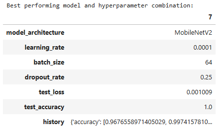
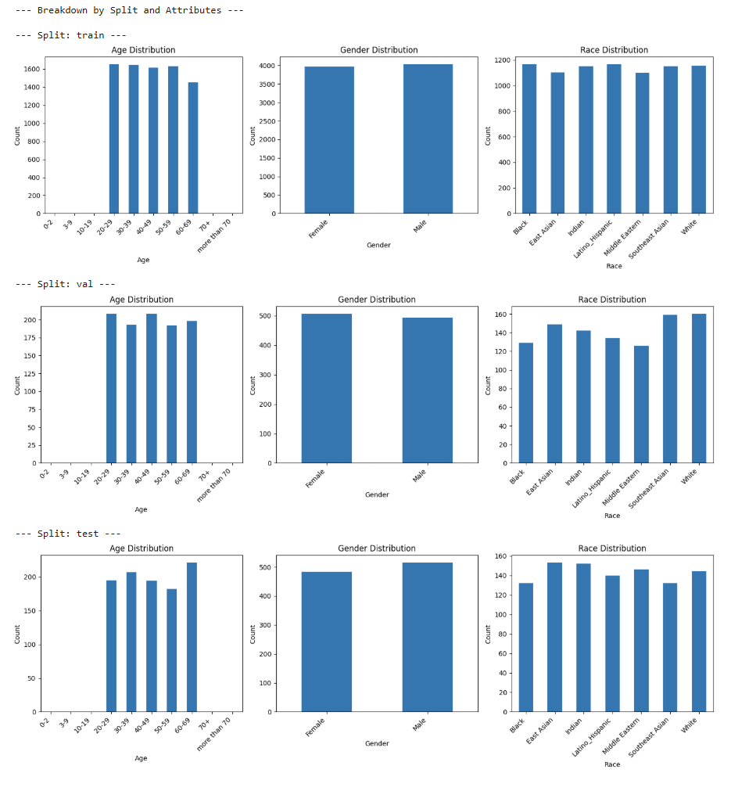
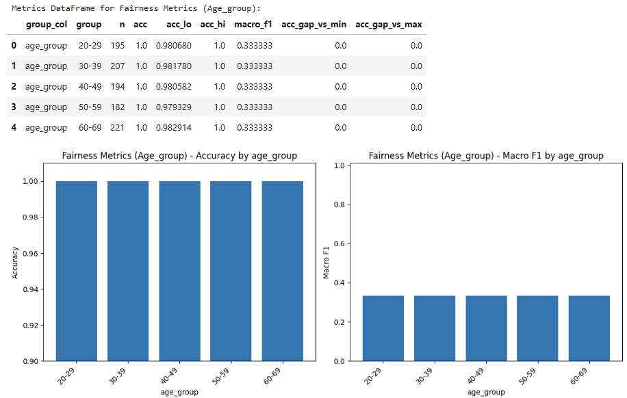
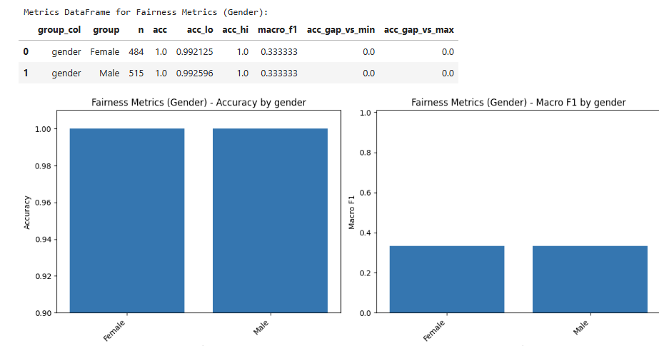
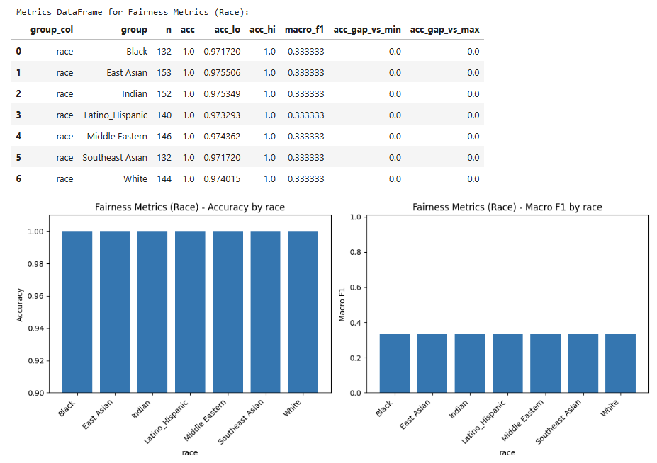
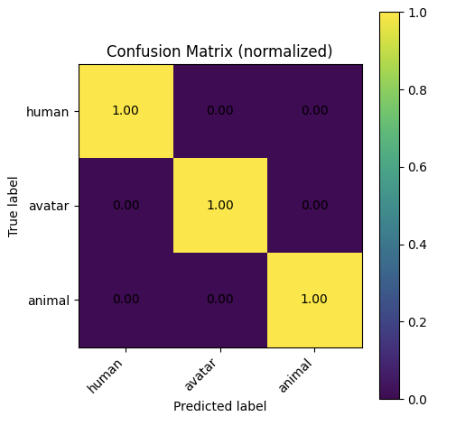
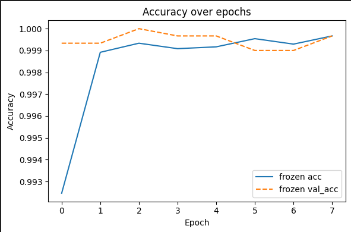
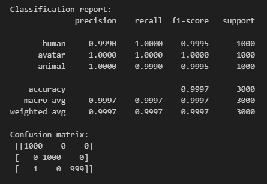

### Photo Classification with ResNet50

**Author** 
Allen Long

#### Executive summary
This project performs **exploratory data analysis (EDA)** and builds a **baseline image-classification model** to determine whether a Microsoft 365 profile picture contains a **real human face** vs. **avatar** vs. **animal** imagery.  
In this module, the focus is on:
- Cleaning and organizing the dataset(s)
- Feature engineering where appropriate
- EDA visualizations to understand variables and relationships
- A single baseline model to serve as a comparison point for Module 24

While this project does not attempt to create the application that will read profile pictures, it does
provide the foundation model that could be used for that effort.

#### Rationale
Accurate identification of real human faces in corporate profile photos improves directory quality, compliance with internal policies, and downstream people-search experiences. Automating this classification reduces manual review burden and increases consistency across a large tenant.

#### Research Question
**Can we reliably distinguish real human-face profile images, avatar images of human faces, and from non-human images (e.g. cat, dog) using a lightweight, production-friendly baseline model?**  

Sub-question explored in EDA:
- Can we accurately predict human images for diverse cultures, ages, and both sexes.

#### Data Sources
Three separate datasets were used to provide input to create a unique dataset for this projects. 

Planned/used sources (documented in notebooks):
- **Human faces:** - FairFace (diverse, labeled faces)
    - Repository: <https://github.com/joojs/fairface>
- **Avatar:** - Google Cartoon Set / “cartoon faces”
    - Kaggle dataset: <https://www.kaggle.com/datasets/brendanartley/cartoon-faces-googles-cartoon-set>
- **Animals** - Dogs vs Cats
    - Kaggle dataset: <https://www.kaggle.com/datasets/salader/dogs-vs-cats>
> Note: The Dogs vs Cats dataset no longer exists on Kaggle.

##### New Features in This Repo
* GridSearch notebook (see [GridSearch.ipynb](GridSearch.ipynb)) Performs analysis of hyper-parameters and alternate models. This was not included in the main notebook to keep it readable. It provides analysis on which would be the best combination of model and hyper-parameters. 
* LeakageSHortcutsAudit notebook (see [LeakageShortcutsAudit.ipynb](LeakageShortcutsAudit.ipynb)) Produces a recommendation of what images to remove based on numerous techniques in ([exclusions.txt](reports/audit_outputs/exclusions.txt))
* GradCAM notebook (see [GradcamInspectionh.ipynb](GradcamInspection.ipynb)) Unfortunately still has problems and does not work.

#### Methodology
1. **Data loading & cleaning** (see [LoadDataset.ipynb](LoadDataset.ipynb)):
This notebook prepares a dataset of human, avatar, and animal faces for a machine learning image classification task. It downloads data from Google Drive and Kaggle, applies filtering based on age (for humans) and image quality (min dimension, aspect ratio). Human data is sampled using stratification to maintain demographic balance. All images are deduplicated based on visual content, center-cropped to a square, and resized to a fixed dimension. The processed images are organized into an ImageFolder structure with train, validation, and test splits, and a CSV is generated mapping human images to their labels for traceability.
The final dataset looks like:<br>
```
    Train: 24,000 total -> {'human': 8000, 'avatar': 8000, 'animal': 8000}
    Val: 3,000 total -> {'human': 1000, 'avatar': 1000, 'animal': 1000}
    Test: 3,000 total -> {'human': 1000, 'avatar': 1000, 'animal': 1000}
```
There are two additional CSVs created to enable fairness analysis and leakate/shortcut audit.

> **NOTE**: This dataset will not render in github when there is output in it. Please see the file: <file> for the output.<br>

2. **EDA** (see [UCB_ML_Capstone.ipynb](UCB_ML_Capstone.ipynb)):
   - Class distribution and split verification.
   - Analysis of the sub-classes in the human split for age, sex, and ethnicity.
   - Sample grids of each class.
   - Fairness analysis.
3. **Feature engineering** (see [UCB_ML_Capstone.ipynb](UCB_ML_Capstone.ipynb)):
   - Basic augmentations using a Keras data_augmentation layer with RandomFlip, RandomRotation, RandomBrightness, and RandomContrast during training.
4. **Baseline model** (trained/evaluated in [UCB_ML_Capstone.ipynb](UCB_ML_Capstone.ipynb)):
   - **Approach:** Pretrained ResNet50 (frozen) as a feature extractor, with a small classification head (softmax) for three-way classification — human, avatar, and animal.
   - **Why:** Strong off-the-shelf features, quick to train, easy to deploy; serves as a fair, reproducible starting point for Module 24 comparisons.
5. **Evaluation (baseline):**
   - Accuracy, precision/recall/F1 (macro), confusion matrix.
   - Per-class recall to surface asymmetries.
   - Balanced human images (fairness)


## Results

### Leakage and SHortcuts
- pHash duplicate report reviewed (`cross_split_phash_near_duplicates*.csv`)
- Embedding-based near-duplicate report reviewed (`cross_split_embedding_near_duplicates.csv`)
- Identity leakage report reviewed (`cross_split_identity_leakage.csv`)
- Metadata-only shortcut report reviewed (`metadata_only_shortcut_report.txt`)
- ([exclusions.txt](reports/audit_outputs/exclusions.txt)) created to use with the data loader.

### Best Model and Hyper-Parameters
- After testing 24 combinations of model, learning rate, batch size, and dropout rate, the best mix is:


### Audit for Leakage and Shortcuts
Numerous audit techniques were used. The combined result for recommended exclusions can be found in ([exclusions.txt](reports/audit_outputs/exclusions.txt)).

### Fairness
Fairness was analyzed with a number of methods. We see that the dataset is well balanced across age, gender, and race.


Because F1 is computed across all 3 classes, the two classes that don’t appear in that slice get F1=0 (with zero_division=0). The one present class has F1=1 (since accuracy is 100%). Averaging (1 + 0 + 0) / 3 = 0.333....




### Training Results
Model saturated with the frozen backbone. It's already near-perfect with the head-only training. 
* Per-class recall = 100% (each row sums to 1 and all mass is on the correct column).
* Because there are no off-diagonal counts anywhere, there are also 0 false positives → precision = 100% and F1 = 1.0 for all classes on this eval set.
* Overall accuracy is effectively 100% on this split.


The training and validation accuracy for the frozen base model are extremely high, roughly 99.8–100% after the first couple of epochs. Early stopping happened at epoch 8 when 15 total epochs were set.


- Accuracy: 0.9997 on 3,000 images (2,999/3,000 correct).
- Macro/weighted F1: 0.9997 — performance is uniformly high across classes.


The sample output demonstrates the ability of the model to classify humans, avatars (of human faces), and animals (cats, dogs).


#### Next steps
There are many opportunities to do additional analysis and modeling in the next round.
- The images were limited to humans, avatars, and pets (cats, dogs) for this assignment, but a profile picture could be anything. There is a need to test against a more diverse set of images and improve the dataset and model to handle those.
- There are other models to try, including light-weight CNNs like MobileNetV2, vision transformers, and other approaches.
- Look at hyperameters and tuning, including batch size, image size, unfrozen layers, regularization, and more.
- Finetuning
- Packaging for Azure (independent of this assignment). [Repo](https://github.com/lobral2728/azureprofileapp)
- I'm looking forward to the upcoming module that cover CNNs to learn other steps to try.

NEW
- Unfreeze top layers to try to get a little extra accuracy.

#### Outline of project
- [LoadDataset.ipynb with no output](LoadDataset.ipynb) — dataset ingestion, cleaning, splits, and data quality checks. The notebook created in Google Colab does not render in GitHub when there is output in it. This notebook shows the code.
- [LoadDataset.ipynb with output](output/LoadDataset.ipynb) - This notebook shows output. You will need to clone the repo and look at the notebook with VS Code or a similar tool.
- [UCB_ML_Capstone.ipynb](UCB_ML_Capstone.ipynb) — EDA visuals, baseline model training/evaluation, and error analysis.

##### Contact and Further Information
For questions or collaboration, please contact **Allen Long** by filing an issue in the GitHub repo.
